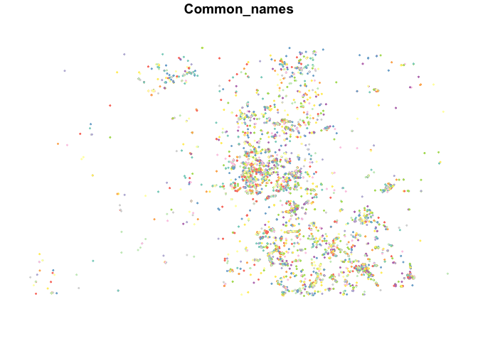
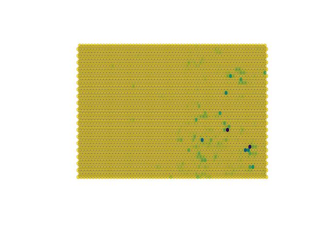
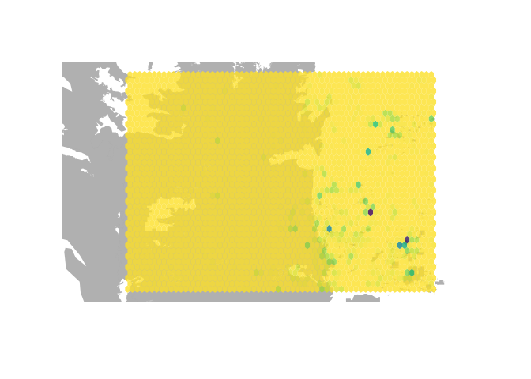
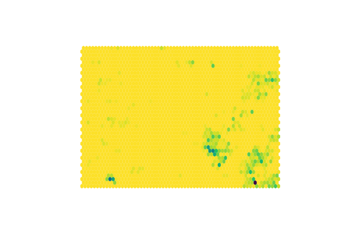
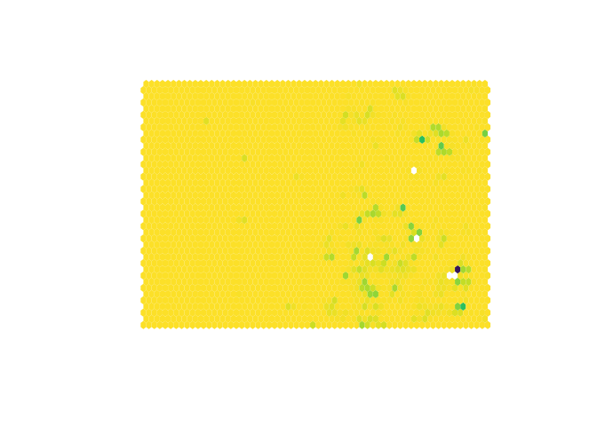
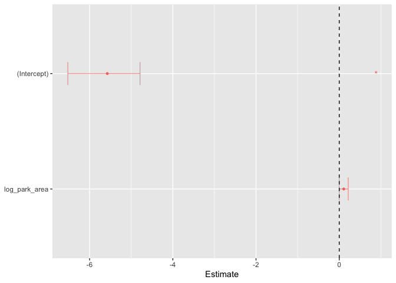

Ty Tuff’s submitted code sample
================

# Earth\_Lab\_Sampler

This is a work sample submitted by Ty Tuff as part of his application to
become the next data scientist for CIRES Earth Lab.

This icon links to a binder for this repository. MyBinder was unable to
install gdal, which is an essential package for a number of other
packages and functions in this script. Accordingly, this binder is not
very useful because it can’t successfully execute the code but it can
show you what Rstudio looks like.
[](http://mybinder.org/v2/gh/ttuff/Earth_Lab_Sampler/main?urlpath=rstudio)

``` r fold-hide
library("rgdal") 
library("sf")
library('tidyverse')
library('spocc')
library('mapr')
library("scrubr")
library("osmdata")
library("raster")
library("osmdata")
library("taxize")
library("INLA")
library("data.table")
library("sp")
library("spdep")
library("ggregplot")
```

# Where and Why are people generating iNaturalist data in Boulder County?

iNaturalist is a mobile application that allows people to take photos of
plants or animals they encounter in their environment and returns the
identification of that species so people can learn more about those
species. The user takes a photo of any species they encounter and upload
that photo to the cloud, along with the metadata for the time and
location when the photo was taken. Cloud computation services then use
an AI classification algorithm to identify a list of candidate species
matching the photo and location and return those result to the user for
verification. The verified observation is then added to an iNaturalist
databases that already includes over 68 Million individual occurrence
records after only a few years of operation. These records are available
through an iNaturalist API, but those records are also dumped into the
GBIF database, where they undergo a small round of quality control that
clean up the data in a few minor ways. I access these data using the
‘spocc’ package in R, which consolidates the API protocols for several
different species occurrence API services into a single API syntax
housed in one package. The ‘spocc’ package also interacts natively with
the ‘taxis’ package to clean and standardize species names and common
names across all taxa.

### iNaturalist API

This code is an example showing how to pull data for a single species
from the GBIF database. This is a great way to get data for an
individual species, but GBIF suggests you use their online tool, rather
than their API, for downloading multiple species at one time. You can
set up a for loop to automate a list of species, but that unnecessarily
drives up maintenance costs for GBIF, and they will again point you back
to the online tool.

``` r
(df <- occ(query = 'Sciurus carolinensis', from = 'gbif',  has_coords = TRUE))
df2 <- occ2df(df)
class(df2)
df3 <- dframe(df2) %>% scrubr::fix_names( how = 'shortest')

df3 <- df3[df3$latitude > 45  & df3$longitude > -74 & df3$longitude < -73 ,,drop=TRUE]
df3
```

### GBIF online download tool

Here I upload the file that I downloaded from gbif.org. To create this
file, I used GBIF’s online tool to draw a bounding box around Boulder
county and specified that I wanted all data with (1) Geographic
coordinates, (2) No known errors, (3) recorded in 2021, and (4)
iNaturalist listed as their provider. The provide that data in the form
of a CSV, which I added to a folder called “rawData” in the working
directory. These data come as a dataframe of occurrence records, which
each record taking a row and different variables taking the columns. The
first thing I do is clean the names using the ‘scrubr’ package. Then I
plot the raw data to make sure they meet my expectations. I’m checking
for anomalies that would be cause by improper loading, like the wrong
spatial extent or unexpectedly empty fields.

``` r
gbif <- fread("rawData/0289344-200613084148143.csv",header=TRUE)
GBIF <- gbif %>% scrubr::fix_names( how = 'shortest')

plot(gbif$decimalLatitude, gbif$decimalLongitude)
```


I did a quick automated data clean using the ‘scrubr’ package, but I
wanted to go a few steps further to replace scientific names with common
names when appropriate. Common names are common in some fields like
Ornithology and Mammalogy, but they are uncommon in Botany and
Microbiology. The corrections produced in this section reflect those
customs and only favor common names for species where they’re regularly
provided in the iNaturalist dataset. I thinned the dataset to include
only unique entries. This was largely about making this example smaller
and easier to run quickly. There are repeated records from some notable
individuals like birds of prey in public parks or notable trees on
people’s walk to work. These individuals are recorded regularly and
repeatedly and could be included in an example less pressed from space.

``` r
# Thin to unique
a <- sci2comm(as.character(unique(GBIF$verbatimScientificName)))
```

``` r
# Make a list of matches between scientific names and common names
common_names <- as.data.frame( unlist(a), byrow=TRUE, ncol=2)
common_names <- cbind( rownames(common_names), common_names)
names(common_names) <- c("verbatimScientificName","common_names")
write.csv(common_names, file="rawData/Common_names.csv")

# Join that list to the dataset
Common_GBIF <- GBIF %>% left_join(common_names, by="verbatimScientificName")
Common_GBIF <- Common_GBIF[,c(51,14, 22,23 )] 
Common_GBIF[which(is.na(Common_GBIF$common_names) == TRUE),1] <- Common_GBIF[which(is.na(Common_GBIF$common_names) == TRUE),2]

# Add coordinates
coords = data.frame(
  x=Common_GBIF$decimalLongitude,
  y=Common_GBIF$decimalLatitude
)

# reformat for spatial analysis
GBIF_common_names <- as.data.frame(Common_GBIF$common_names)
names(GBIF_common_names) <- "Common_names"

sp_GBIF <- SpatialPointsDataFrame(coords,GBIF_common_names )
st_GBIF <- st_as_sf(SpatialPointsDataFrame(coords,GBIF_common_names ))

# Plot to check that everything worked
plot(st_GBIF, pch=19, cex=0.25)
```

<!-- -->

### Hexagon grid to aggregate data for standardized analysis

Sampling scheme is a critical component to any analysis. I sample the
points above by laying a hexagonal grid over the occurrence points and
aggregating those points into those hex bins for modeling. For a 2D
spatial analysis like the one we’re doing here, I prefer a hexagon
lattice over a square lattice because it has a more symmetrical
adjacency matrix. In a square lattice, the diagonals between cells are
longer than the horizontal and vertical distances. In hexagonal grids,
all adjacency distances are equal. This code creates the hex grid to be
used below for sampling. The extent of this grid is set by the Boulder
County bounding box and he resolution was set to be rather course to
speed up computation time and keep this example light and fast.

``` r
# Define bounding box
 ext <- as(extent(getbb ("Boulder County Colorado")) , "SpatialPolygons")

# Set spatial projection
  crs(ext) <- "EPSG:4326"
  
# Use spsample to measure out a grid of center points within the bounding box  
  h <- spsample(ext, type = "hexagonal", cellsize = 0.01)
    
# convert center points to hexagons
  g <- HexPoints2SpatialPolygons(h, dx = 0.01)
  
# Reformat for easy plotting
  g <- st_as_sf(g)
 
# Plot to check that it's built corrrectly  
  plot(g, lwd=0.1)
```


``` r
# Make the dataset more presentable
  hex_polys <- cbind(seq(1, length(g$geometry)), g)
  colnames(hex_polys) <- c("id_polygons", "geometry") # change colnames
```

### Aggregate iNaturalist data into hex bins

Now that we have iNaturalist data formatted as points and a hex grid
built for sampling those points, it’s time to bin those points into
their appropriate hexagons. I do this using an intersect function that
builds a dataframe by assigning each occurrence point to the hexagonal
polygon that encompasses it’s coordinates. I then group those data by
their new polygon identifier and plot the hexagon grid with a fill color
gradient representing the number of unique occurrence points in that
polygon.

#### Inspect the points overlaying the grid.

``` r
st_crs(st_GBIF) <- crs(hex_polys)
intersection <- st_intersection(x = hex_polys, y = st_GBIF)

int_result <- intersection %>% 
  group_by(id_polygons) 

plot(g, lwd=0.1)
plot(int_result$geometry, pch=19, cex=0.25, col=adjustcolor("cornflowerblue", alpha.f = 0.2), add=TRUE)
```


#### Aggrigate points into hex bins

``` r
# Create storage device
species_richness <- rep(0, max(hex_polys$id_polygons))
hex_counts <- cbind(hex_polys, species_richness)

# Count points per hexagon
int_count <- intersection %>% 
  group_by(id_polygons, .drop = FALSE) %>% 
  count()

# Add counts to storage device
hex_counts$species_richness[int_count$id_polygons] <- int_count$n

# Plot
plot(hex_counts$geometry, lwd=0.001, 
     col=grey.colors(max(hex_counts$species_richness), rev = TRUE, start=0, end=1)[hex_counts$species_richness+1])
plot(int_result$geometry, pch=19, cex=0.05, col=adjustcolor("cornflowerblue", alpha.f = 0.2), add=TRUE)
```


#### Plot species richness using a fancy color scheme that works well for color-blind people

A count of the number of species in an area is called species richness.
Species richness is a common proxy variable used to describe differences
between ecosystems or health within a single ecosystem. It provides an
incomplete description of an ecosystem, but species richness is still
frequently used as a good indicator of ecosystem type and health because
more complex ecosystems have more species and so, the number of species
can often approximate complexity and complexity is a defining feature of
ecosystems.

``` r
plot(hex_counts$geometry, lwd=0.001, 
     col=hcl.colors(max(hex_counts$species_richness)+2, palette = "viridis", alpha = NULL, rev = TRUE, fixup = TRUE)[hex_counts$species_richness+1])
```


### Adjacency matrix

We need to include a list of neighbor relationships as a random
co-variate in our model. Her we calculate that adjacency matrix using a
function that takes a list of polygons and returns the adjacency matrix.
I give this function the hexagon grid, which is built of hexagonal
polygons with centroids, and the function calculates the adjacency
relationships for all those centroids.

``` r
hex_adj <- poly2nb(as(hex_counts, "Spatial") )

plot(hex_counts$geometry, lwd=0.001, 
     col=hcl.colors(max(hex_counts$species_richness)+2, palette = "viridis", alpha = NULL, rev = TRUE, fixup = TRUE)[hex_counts$species_richness+1])
plot(hex_adj, coordinates(as(hex_counts, "Spatial")), col="darkblue", lwd=0.2, add=TRUE)
```

<!-- -->

### Co-variates

Data don’t produce themselves in a vacuum, they are created by a process
and that process involves many parts. I am now going to organize some
data to act as co-variates in a model predicting iNaturalist species
richness. These variables should relate to hypotheses about mechanisms
that created these data and they should be at the same spatial and
temporal scale as other data in the analysis.

#### Open Street Map data

On of my favorite datasets to use on a daily basis is Open Street Map.
It is an amazing resource for a suite of different data about land use,
amenities, administrative boundaries, points of interest, routing, and
construction. The code below pulls polygons and multipolygons from the
OSM API based on value/key pairs. I picked each value/key pair using the
OSM tags wiki website, which catalogs all the available data in OSM. I
search for different tags that described green space and I wrote a new
API call for each value/key pair that I thought applicable. I
concatenate those individual data requests into a single green space
dataset. I then make three more individual calls to retrive data for
buildings, roads, and agricultural fields. I think each of these may be
contributing to our response variable so, I have left as individual
dataframes so they can be treated individually in the modeling process.

``` r
name <- "Boulder County Colorado"

try(my_bbox <- osmdata::getbb (name))

my_bbox[1,1] <- my_bbox[1,1] + 0.02


dat1 <- opq(bbox = my_bbox, timeout = 900) %>%
    add_osm_feature(key = 'leisure', value = 'park') %>%
    osmdata_sf ()
dat2 <- opq(bbox = my_bbox, timeout = 900) %>%
    add_osm_feature(key = 'leisure', value = 'garden') %>%
    osmdata_sf ()
dat3 <- opq(bbox = my_bbox, timeout = 900) %>%
    add_osm_feature(key = 'leisure', value = 'nature_reserve') %>%
    osmdata_sf ()
dat4 <- opq(bbox = my_bbox, timeout = 900) %>%
    add_osm_feature(key = 'leisure', value = 'dog_park') %>%
    osmdata_sf ()
dat5 <- opq(bbox = my_bbox, timeout = 900) %>%
    add_osm_feature(key = 'leisure', value = 'common') %>%
    osmdata_sf ()
dat6 <- opq(bbox = my_bbox, timeout = 900) %>%
    add_osm_feature(key = 'leisure', value = 'pitch') %>%
    osmdata_sf ()
dat7 <- opq(bbox = my_bbox, timeout = 900) %>%
    add_osm_feature(key = 'leisure', value = 'horse_riding') %>%
    osmdata_sf ()
dat8 <- opq(bbox = my_bbox, timeout = 900) %>%
    add_osm_feature(key = 'natural', value = 'wood') %>%
    osmdata_sf ()
greens <- c (dat1, dat2, dat3, dat4, dat5, dat6, dat7, dat8)


buildings <- opq(bbox = my_bbox, timeout = 900) %>%
    add_osm_feature(key = 'building') %>%
    osmdata_sf ()

roads <- opq(bbox = my_bbox, timeout = 900) %>%
    add_osm_feature(key = 'landuse', value = 'residential') %>%
    osmdata_sf ()

agriculture <- opq(bbox = my_bbox, timeout = 900) %>%
    add_osm_feature(key = 'landuse', value = 'farmland') %>%
    osmdata_sf()
```

#### Plot the green space data downloaded from OSM against the species richness data to make sure they overlap well.

``` r
plot(hex_counts$geometry, lwd=0.001, 
     col=hcl.colors(max(hex_counts$species_richness), palette = "viridis", alpha = 0, rev = TRUE, fixup = TRUE)[hex_counts$species_richness+1])
plot(greens$osm_polygons[1], add=TRUE, lwd=0.01, col=adjustcolor("grey", alpha.f = 1))
plot(greens$osm_multipolygons[1], add=TRUE, lwd=0.01, col=adjustcolor("grey", alpha.f = 1))
#plot(buildings$osm_polygons[1], add=TRUE, lwd=0.01, col=adjustcolor("black", alpha.f = 1))
plot(hex_counts$geometry, lwd=0.001, 
     col=hcl.colors(max(hex_counts$species_richness)+2, palette = "viridis", alpha = 0.8, rev = TRUE, fixup = TRUE)[hex_counts$species_richness+1], add=TRUE)
```

<!-- -->

### Aggregate covariates to hex bins using the same method as we did with species richness

Aggregating data to hexagon bins will be a required procedure for all
covariates, which means we will need to repeat this procedure and it
make sense to stop and make a function to keep our code clean. The first
of these functions calculates polygon area for the greenspace polygons
and adds that area calculation back into the dataset as a covariate.

``` r
covariate_hex_greens <- function(sf_object){

if(length(sf_object$osm_multipolygons) > 0){
  poly_area <- st_area(sf_object$osm_polygons)
multi_poly_area <- st_area(sf_object$osm_multipolygons)
log_area1 <- as.data.frame(as.numeric(log(poly_area)))
log_area2 <- as.data.frame(as.numeric(log(multi_poly_area)))
names(log_area1) <- "log_area"
names(log_area2) <- "log_area"
log_area <- rbind(log_area1, log_area2) 

coords <- rbind(sf_object$osm_polygons %>% st_centroid() %>% st_coordinates(), 
                sf_object$osm_multipolygons %>% st_centroid() %>% st_coordinates())
} else {
  poly_area <- st_area(sf_object$osm_polygons)
log_area <- as.data.frame(as.numeric(log(poly_area)))
names(log_area) <- "log_area"

coords <- sf_object$osm_polygons %>% st_centroid() %>% st_coordinates()
}

if(length(coords[,1]) != length(log_area[,1])) stop("wrong length")
area_points <- cbind(log_area, coords)
colnames(area_points)[2:3] <- c("longitude", "latitude")
sf_area_points <- st_as_sf(area_points, coords = c("longitude", "latitude"), 
    crs = 4326, agr = "constant")

return(sf_area_points)
}
```

The second function does the same aggregation procedure as I did with
species richness, which is to say that it counts then number of
occurrences within a bin and assigns that bin a value for that count.
The other function in this chunk is a clone of the counting function
modified to report mean rather than count. The mean version of the
function is valuable or the greenspace area data where reporting the
mean area of greenspace if more informative than the count of parks in
that bin.

``` r
# Count the number of points in each bin
point_to_hex_count <- function(hex_polys, points){
intersection <- st_intersection(x = hex_polys, y = points)

counter <- rep(0, max(hex_polys$id_polygons))
hex_count <- cbind(hex_polys, counter)

counted <- intersection %>% 
  group_by(id_polygons, .drop = FALSE) %>% 
  count()

hex_count$area[counted$id_polygons] <- counted$n

return(hex_count)
}


# Report the mean value for each bin
point_to_hex_mean <- function(hex_polys, points){
intersection <- st_intersection(x = hex_polys, y = points)

area <- rep(0, max(hex_polys$id_polygons))
hex_area <- cbind(hex_polys, area)

avg_area <- intersection %>% 
  group_by(id_polygons, .drop = FALSE) %>% 
  summarise(mean = sum(log_area, na.rm=TRUE))

hex_area$area[avg_area$id_polygons] <- avg_area$mean

return(hex_area)
}
```

#### Run those functions on our green space data to produce a plot of green space area intensity

The plot below show the total area of greenspace per polygon. My
hypothesis is that the presence of green space is a major predictor of
iNaturalist data and want to compare this plot to the species richness
plot to see it it looks like green spaces and iNaturalist records are
generally located in the same places.

``` r
green_pts <- covariate_hex_greens(greens)
green_hex <- point_to_hex_mean(hex_polys, green_pts)
hex <- green_hex
plot_variable <- function(hex, variable ){
plot(hex$geometry, lwd=0.001, 
     col=hcl.colors(max(as.integer(green_hex$area)+2, na.rm = TRUE), palette = "viridis", alpha = NULL, rev = TRUE, fixup = TRUE)[as.integer(green_hex$area, na.rm=TRUE)+1])
}
plot_variable(green_hex, green_hex$area)
```

<!-- -->

### Combine Species richness and covariates into the same dataframe for analysis.

In the previous code, I have created two spatial objects that are both
hex grids with aggregated data assigned to each bin. To combine those
sets, I first drop the geometry from one of the two because the
geometries are identical and they will show up as duplicates in the
combined dataset. After droping the geometry from one, I do a left join
so they match polygonID values and then everything shares the single
remaining geometry column.

``` r
hex_list <- st_drop_geometry(hex_counts) %>% inner_join(as.data.frame(green_hex), by="id_polygons") 
colnames(hex_list) <- c("id_polygon", "species_richness", "park_size_average","geometry")
head(hex_list)
```

    ##   id_polygon species_richness park_size_average                       geometry
    ## 1          1                0                 0 POLYGON ((-105.6911 39.9248...
    ## 2          2                0                 0 POLYGON ((-105.6811 39.9248...
    ## 3          3                0                 0 POLYGON ((-105.6711 39.9248...
    ## 4          4                0                 0 POLYGON ((-105.6611 39.9248...
    ## 5          5                0                 0 POLYGON ((-105.6511 39.9248...
    ## 6          6                0                 0 POLYGON ((-105.6411 39.9248...

### INLA Bayesian inference

The standard method for modern day model fitting is to use Markov chains
to search for parameter values that allow equations to describe
mechanisms for creating data. MCMC is a slow an laborious process
because it searches continuous numerical space to find the lowest point
of that surface, which represents the highest probability value.
Integrated Nested Laplace Approximation (INLA) is a deterministic
Bayesian method that approximates the same probability surface using
triangular tessellation to simplify the surface and then search for
minima on that approximated surface. Tessellating this surface has the
potential to smooth over the global maxima to lower the precision of the
extimate, but it can find that slightly less precise estimate orders of
magnitude faster. Even if you want to use MCMC for the final model fit,
INLA can quickly give you very good approximations of the continuous
minimum values.  
Here I set up a linear model using familiar GLMM syntax. Species
richness is the response variable being predicted by the covariates. The
covariates included in this model are park size (e.g. mean area for all
parks in each hexagon), a random effect (e.g. polygon ID), and the
adjacency matrix defined by the hexagonal grid. I use a poisson link
function because my iNaturalist data are counts and the poisson
distribution is the distribution for count data.

``` r
# Park sizes spanned such a great range of values that the a few massive open spaces dominated the analysis. I softened that effect by log transforming park area averages.   
hex_list$log_park_area <- log(hex_list$park_size_average)
hex_list[which(is.infinite(hex_list$log_park_area) == TRUE),"log_park_area"] <- 0

#This version of the inla model represents the adjacency matrix using a 2d random walk around the mesh grid.
#Run the model
m0.rw2d <- inla(species_richness ~ log_park_area +
    f(id_polygon, model = "rw2d", nrow =64, ncol = 41),
  family = "poisson", data = as.data.frame(hex_list),
  control.predictor = list(compute = TRUE),
  control.compute = list(dic = TRUE) )

# Print a summary of the model results. This is a single model, so no model comparisons happen yet. 
summary(m0.rw2d)
```

    ## 
    ## Call:
    ##    c("inla(formula = species_richness ~ log_park_area + f(id_polygon, ", " 
    ##    model = \"rw2d\", nrow = 64, ncol = 41), family = \"poisson\", ", " 
    ##    data = as.data.frame(hex_list), control.compute = list(dic = TRUE), ", 
    ##    " control.predictor = list(compute = TRUE))") 
    ## Time used:
    ##     Pre = 3.23, Running = 15.3, Post = 0.337, Total = 18.9 
    ## Fixed effects:
    ##                 mean    sd 0.025quant 0.5quant 0.975quant   mode kld
    ## (Intercept)   -5.575 0.442     -6.524   -5.546     -4.787 -5.488   0
    ## log_park_area  0.108 0.055      0.000    0.108      0.216  0.108   0
    ## 
    ## Random effects:
    ##   Name     Model
    ##     id_polygon Random walk 2D
    ## 
    ## Model hyperparameters:
    ##                           mean    sd 0.025quant 0.5quant 0.975quant  mode
    ## Precision for id_polygon 0.042 0.003      0.036    0.042      0.049 0.041
    ## 
    ## Expected number of effective parameters(stdev): 747.33(12.44)
    ## Number of equivalent replicates : 3.40 
    ## 
    ## Deviance Information Criterion (DIC) ...............: 6093.34
    ## Deviance Information Criterion (DIC, saturated) ....: 4471.39
    ## Effective number of parameters .....................: 1933.32
    ## 
    ## Marginal log-Likelihood:  -5334.88 
    ## Posterior marginals for the linear predictor and
    ##  the fitted values are computed

``` r
# Pass summary results back to the dataset so we can map them. 
hex_list$RW2D <- m0.rw2d$summary.fitted.values[, "0.5quant"]
hex_list$RW2Dsd <- m0.rw2d$summary.fitted.values[, "sd"]
```

### Plot the mean predicted values from the model.

A plot of our results show that green space area is remarkably
predictive of iNaturalist species richness. The three major clusters in
iNaturalist data match the three major clusters in green space area.

``` r
model_predict <- floor(hex_list$RW2D)
model_predict[which(is.na(model_predict) == TRUE)] <- 0 

plot(hex_list$geometry, lwd=0.001, 
     col=hcl.colors(max(floor(hex_list$RW2D))+2, palette = "viridis", alpha = NULL, rev = TRUE, fixup = FALSE)[floor(hex_list$RW2D)+1])
```

<!-- -->

### Is the fit good?

There are not P-values in INLA. Where an MCMC fit would use AIC values
to compare different model fits, INLA uses a DIC or Deviance information
criterion. In the figure below, we want our confidence intervals to NOT
overlap zero. My predictor variable overlaps zero at the very lower tail
of its distribution, but largely avoids it. This is a good indication
that the species richness of iNaturalist records can be fairly
accurately predicted by the area of green space and the adjacency of
that green space to other green space.

``` r
Efxplot(list(m0.rw2d))
```

<!-- -->

### Next Steps

To publish this analysis, I would need to build a few competing models
representing different hypotheses and compare those models against each
other using DIC model comparison. Each model will need to be internally
tested to see if it should include random effects or not. The suite of
competing models should be compared against each other using DIC to
assign the best hypothesis given the data and the models presented.
